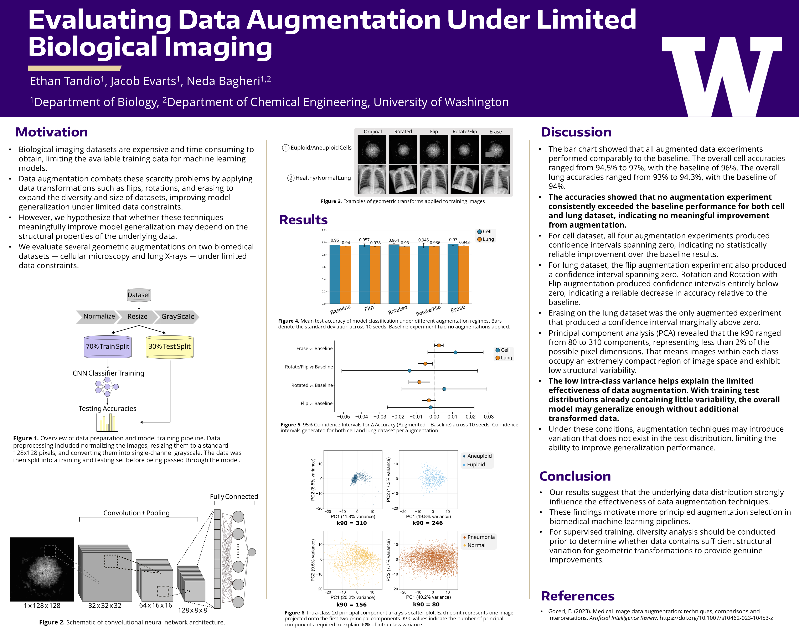

# Image Augmentation in Limited-Data CNN Classification

This project measures how image augmentation affects a small convolutional
neural network when labeled training data are limited. The same experiment
design is applied to two binary image-classification tasks:

- Cell microscopy: euploid versus aneuploid cells.
- Chest X-rays: normal versus pneumonia images from PneumoniaMNIST.

The study compares a limited-data baseline with horizontal flipping, rotation,
combined rotation and flipping, and random erasing. Every configuration runs
with 10 random seeds. The repository retains the resulting ablation chart,
paired confidence-interval plot, and intra-class PCA density figure.

## Project poster



## Reproducibility boundary

Docker reproduces the Python environment and commands. It cannot distribute or
recover the cell microscopy dataset, which is not included in this repository.
To reproduce both tasks, obtain the original cell images separately and arrange
them as described below.

PneumoniaMNIST is public and is downloaded automatically by the included data
creation script.

The pipeline fixes Python, NumPy, and PyTorch seeds. It also persists a
stratified train/test split under `saved_splits/`. These controls make repeated
runs consistent within the same environment, although exact bitwise equality is
not guaranteed across different hardware or operating systems.

## Repository layout

```text
configs/                 Experiment configurations
src/                     Dataset, model, training, and evaluation code
scripts/
  create_data2.py        Build the cell ImageFolder dataset
  create_pneumonia_dataset.py
                          Download and build the pneumonia dataset
  PCA_Analysis.py        Generate the retained PCA figure
  compute_paired_statistics.py
                          Compute paired seed-level statistics
  plot_paired_cis.py     Generate the paired 95% CI figure
main.py                  Run experiments and create the ablation chart
all_plots/               Seed accuracies and text reports
statistics/paired/       Paired statistics and CI figure
visualizations/          Retained ablation and PCA figures
```

The dataset directories, split indices, caches, and checkpoints are intentionally
excluded from Git. Docker Compose mounts them from the host so generated data and
results survive after a container exits.

## Dataset preparation

### Cell microscopy data

Place the original PNG files in this layout:

```text
Data/
  Aneuploid/
    ...
  Euploid/
    ...
```

`scripts/create_data2.py` selects filenames ending in `8.png` and creates:

```text
data2/
  Aneuploid2/
  Euploid2/
```

The raw cell images are required only to build `data2/`. If a prepared `data2/`
already exists, the raw `Data/` directory is not needed for training.

### PneumoniaMNIST data

`scripts/create_pneumonia_dataset.py` downloads all official PneumoniaMNIST
source splits and exports them into the flat class layout used by this completed
study:

```text
data4/
  normal/
  pneumonia/
```

The training pipeline then creates one fixed stratified 70/30 split from this
combined collection. This preserves the design used for the reported results;
it does not preserve MedMNIST's original train/validation/test boundaries.

## Run with Docker

Requirements:

- Docker Desktop or another Docker installation with Compose support.
- The cell dataset, if reproducing the cell experiments.
- Sufficient CPU time and disk space. A full run trains 14 configurations with
  10 seeds each and can take a long time.

Build the image from the repository root:

```bash
docker compose build
```

Create the cell dataset after placing the raw files under `Data/`:

```bash
docker compose run --rm experiment python scripts/create_data2.py
```

Download and create the pneumonia dataset:

```bash
docker compose run --rm experiment python scripts/create_pneumonia_dataset.py
```

Run every cell and pneumonia configuration:

```bash
docker compose run --rm experiment python main.py
```

Run only pneumonia experiments:

```bash
docker compose run --rm experiment python main.py --pneumonia
```

Run a small, explicit selection:

```bash
docker compose run --rm experiment python main.py --configs small_no_aug.yaml pneumonia_subset_baseline.yaml
```

Compose mounts `data2/`, `data4/`, `saved_splits/`, `all_plots/`,
`statistics/`, and `visualizations/`, so outputs are written directly into the
host repository.

## Run without Docker

Python 3.12 is recommended.

```bash
python -m venv .venv
```

Activate the environment:

```powershell
# Windows PowerShell
.\.venv\Scripts\Activate.ps1
```

```bash
# macOS/Linux
source .venv/bin/activate
```

Install the pinned dependencies:

```bash
python -m pip install --upgrade pip
python -m pip install -r requirements.txt
```

Then use the same Python commands without the `docker compose run` prefix:

```bash
python scripts/create_data2.py
python scripts/create_pneumonia_dataset.py
python main.py
```

## Experiment design

For each dataset, `main.py` runs:

- Full-training baseline.
- Limited-training baseline using 35% of the training partition.
- Limited data with horizontal flipping.
- Limited data with random rotation.
- Limited data with rotation and flipping.
- Limited data with random erasing.
- Limited data with rotation, flipping, and random erasing.

All images are converted to grayscale, resized to 128×128, transformed into
tensors, and normalized to mean 0.5 and standard deviation 0.5. Test images are
never augmented.

The fixed test partition is 30% of each dataset. Limited-data configurations
retain a stratified 35% of the remaining training partition. That subset changes
with the experiment seed but is shared across augmentation methods for a given
seed, enabling paired comparisons.

The CNN contains three convolutional blocks followed by two fully connected
layers. Training uses binary cross-entropy with logits and stochastic gradient
descent for 10 epochs.

## Generate the reported results

### Ablation chart

`main.py` creates this automatically after training:

```text
visualizations/ablation_study/seed_ablation_comparison.png
```

The bars show mean test accuracy across seeds and the error bars show one
population standard deviation.

### Paired 95% confidence intervals

After training, compute paired seed-level differences and plot their confidence
intervals:

```bash
python scripts/compute_paired_statistics.py
python scripts/plot_paired_cis.py
```

With Docker:

```bash
docker compose run --rm experiment python scripts/compute_paired_statistics.py
docker compose run --rm experiment python scripts/plot_paired_cis.py
```

The retained figure is:

```text
statistics/paired/paired_difference_cis.png
```

Each difference is augmentation accuracy minus its limited-data baseline at the
same seed. The reported interval is a paired t interval on the mean difference.

### Intra-class PCA density figure

After both `data2/` and `data4/` exist:

```bash
python scripts/PCA_Analysis.py
```

With Docker:

```bash
docker compose run --rm experiment python scripts/PCA_Analysis.py
```

The retained figure is:

```text
visualizations/pca/figureB_density_scatter.png
```

The script performs PCA separately within each class using flattened 128×128
grayscale images. Each panel displays PC1 versus PC2, density contours, the
class centroid, the number of components needed to reach 90% explained
variance, and spread measurements.

## Outputs

Training writes:

- `all_plots/<experiment>/accuracies/seed_<seed>.txt`: test accuracy.
- `all_plots/<experiment>/train_accuracies/seed_<seed>.txt`: final training
  accuracy.
- `all_plots/<experiment>/accuracy.txt`: first-seed test accuracy.
- `all_plots/<experiment>/report.txt`: first-seed classification report,
  balanced accuracy, and macro-F1.

The three primary result figures are:

- `visualizations/ablation_study/seed_ablation_comparison.png`
- `statistics/paired/paired_difference_cis.png`
- `visualizations/pca/figureB_density_scatter.png`

## Configuration

Each YAML file under `configs/` defines:

- `data_dir`: an ImageFolder-compatible dataset root.
- `data_ratio`: fraction of the training partition used by limited-data runs;
  ignored by full baselines.
- `test_ratio`: held-out test fraction.
- `experiment_type`: selects augmentation and limited-data behavior.
- `dropout_rate`: dropout probability; currently zero in all reported runs.
- `epochs`, `batch_size`, `lr`, and `momentum`: optimization settings.
- `report_path` and `accuracy_path`: output locations.

Use `--configs` to run any subset without editing `main.py`.


